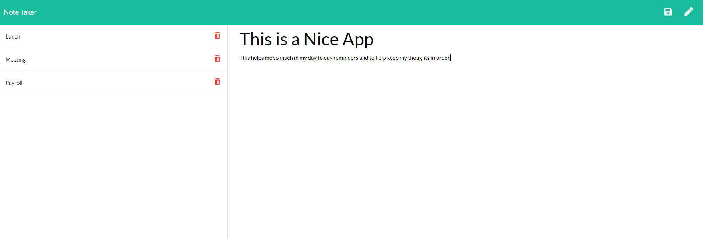

# Note Taker App

      
  # Table of Contents 
  
  * [Description](#description)
  * [Installation](#installation)
  * [Technology](#technology)
  * [Usage](#usage)
  * [Screenshot](#screenshot)
  * [Test](#test)
  * [Demo](#demo)
  * [Questions](#questions)
  * [Credits](#credits)
  * [License](#license)
  
  # Description

  Note Taker App was made to allow the user to make a list of notes when needed to help keep track of thoughts and task that the user needs to complete.
  
  # Installation

  No need to install; please visit the live link below to use the Note Taker App!!

  [Note Taker App](https://evening-escarpment-17766.herokuapp.com/)
  

  
  # Technology
  
     

  # Usage

  To help organize the thougts and task of the user so as to help keep the user more organized and efficent in the day to day in and outs.

  # Screenshot
    
  

  # Test

  No test at this time for application.

  # Demo

  [DEMO](https://drive.google.com/file/d/1UsMfm-d-BDUA8eEsQ5THuKWAZ1iOFlUo/view)

  # Questions  

  GitHub Link: https://github.com/lewisoutdoorllc
  
  Contact via Email: lewisoutdoorllc@gmail.com

  # Credits
  Anthony

  # License
  
  
  Copyright (c) 2021 Cody Lewis

Permission is hereby granted, free of charge, to any person obtaining
a copy of this software and associated documentation files (the
"Software"), to deal in the Software without restriction, including
without limitation the rights to use, copy, modify, merge, publish,
distribute, sublicense, and/or sell copies of the Software, and to
permit persons to whom the Software is furnished to do so, subject to
the following conditions:

The above copyright notice and this permission notice shall be
included in all copies or substantial portions of the Software.

THE SOFTWARE IS PROVIDED "AS IS", WITHOUT WARRANTY OF ANY KIND,
EXPRESS OR IMPLIED, INCLUDING BUT NOT LIMITED TO THE WARRANTIES OF
MERCHANTABILITY, FITNESS FOR A PARTICULAR PURPOSE AND
NONINFRINGEMENT. IN NO EVENT SHALL THE AUTHORS OR COPYRIGHT HOLDERS BE
LIABLE FOR ANY CLAIM, DAMAGES OR OTHER LIABILITY, WHETHER IN AN ACTION
OF CONTRACT, TORT OR OTHERWISE, ARISING FROM, OUT OF OR IN CONNECTION
WITH THE SOFTWARE OR THE USE OR OTHER DEALINGS IN THE SOFTWARE.
    